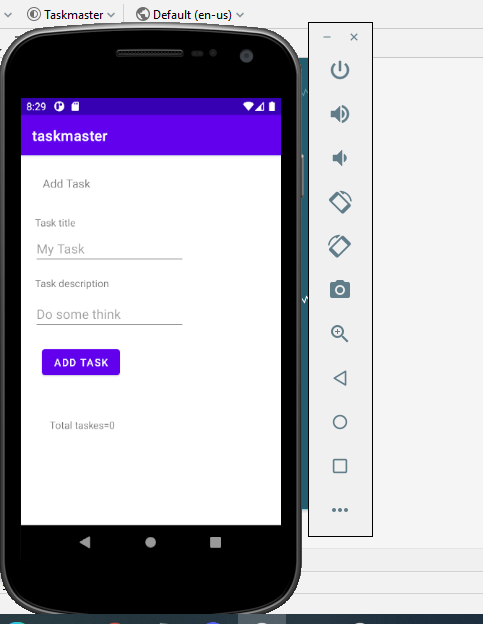
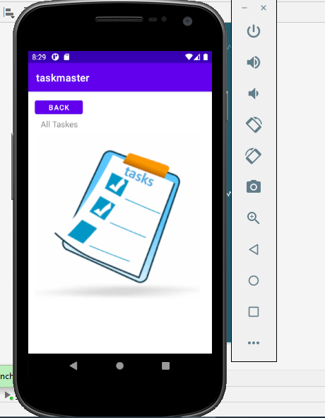

# taskmaster
### Lab: 26 - Beginning TaskMaster
####  building an Android app that contains:

1. Homepage
it should have a heading at the top of the page, an image to mock the “my tasks” view, and buttons at the bottom of the page to allow going to the “add tasks” and “all tasks” page.

2. Add a Task
allow users to type in details about a new task, specifically a title and a body. When users click the “submit” button, show a “submitted!” label on the page.

3. All Tasks
should just be an image with a back button; it needs no functionality.

